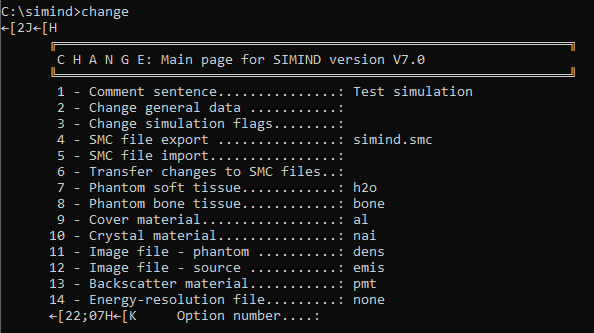
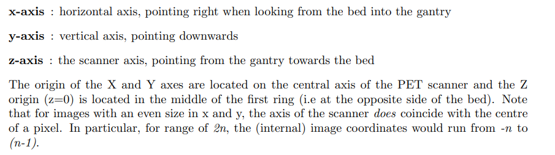
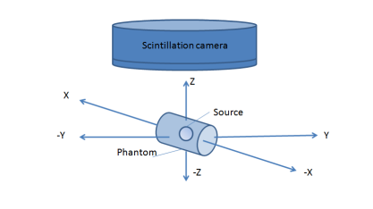
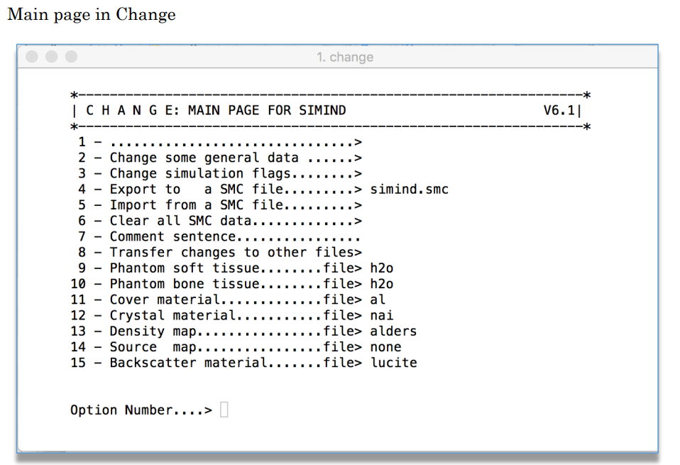

Instructions for those familiar with the use of STIR

Authors: Rebecca Gillen, Sam Porter, Kris Thielemans

Contact: <Rebecca.gillen.18@ucl.ac.uk>, <Sam.Porter.18@ucl.ac.uk>, or subscribe to the STIR users mailing list <https://sourceforge.net/projects/stir/lists/stir-users>

Useful links
============

**2022 STIR Users Group - 'STIR-SIMIND Connection' Presentation**

<https://stir.sourceforge.net/2022UsersMeeting/>

**SIMIND Manual v7.0**

<http://www2.msf.lu.se/simind/download/simind_manual.pdf>

Note: some parts of the manual may still refer to v6.2 (e.g. description
of Main page in change)

**STIR User’s Guide v5.0**

<http://stir.sourceforge.net/documentation/STIR-UsersGuide.pdf>

**STIR Developer’s Overview**

<http://stir.sourceforge.net/documentation/STIR-developers-overview.pdf>

Useful files
============

**Jupyter notebook demo and example python script**[^1]

Jupyter notebook [STIR_simind.ipynb](../python_files/STIR_simind.ipynb)

Python script [STIR_simind.py](../python_files/STIR_simind.py)

**Other useful STIR and SIMIND files**

*SIMIND*:

Example .smc file [input.smc](../input_files/input.smc)

Example file for specifying energy windows [input.win](../input_files/input.win)

*STIR*:
example parameter files for generating data

[generate_emission_image.par](../parameter_files/generate_emission_image.par)

[generate_attenuation_image.par](../parameter_files/generate_attenuation_image.par)

example parameter file for forward projection of SPECT data

[forward_project_SPECT.par](../parameter_files/forward_project_SPECT.par)

*Combining STIR and SIMIND*:

scripts to convert SIMIND headers to STIR-friendly format (.awk file should be in the same directory as .sh file):

Circular orbit [convertSIMINDToSTIR.sh](../scripts/convertSIMINDToSTIR.sh) and [convertSIMINDToSTIR.awk](../scripts/convertSIMINDToSTIR.awk)

Non-circular orbit [convertSIMINDToSTIR_noncirc.sh](../scripts/convertSIMINDToSTIR_noncirc.sh) and [convertSIMINDToSTIR_noncirc.awk](../scripts/convertSIMINDToSTIR_noncirc.awk)

Getting started with SIMIND
===========================

Follow the instructions for download and install from
<https://simind.blogg.lu.se/downloads/>

(*V7.0 available at 06/09/2022* / *updated v7 with linux directory referencing available from 23/01/23*)

There are two key programs within SIMIND:

-   **change** (defines SPECT system and other simulation parameters)

-   **simind** (performs the Monte Carlo simulation)

more detail on each will be given below

Minimum required input files for SIMIND
=======================================

-   Emission data (extension \*.smi)

    -   Must be in 16 bit integer form

-   Density data (extension \*.dmi)

    -   Must be in 16 bit integer form

    -   Units of 1000\*density (e.g. water density = 1.0 g/cm^3^, pixel
        value should be 1000)

-   \*.smc file

    -   File created in/edited with the **change** program

    -   Contains parameters used to define the imaging system

Basic SIMIND instructions; defining parameters for the system (**change**)
==========================================================================

**change** is the program that allows configuration of simulation (i.e.
defines the system)

**change** is an interface for editing the \*.smc file

*Usage:*

&gt; change

Opens “Main” page in order to edit simind.smc file

-   simind.smc initially holds all the default parameters, but is
    updated whenever you close the “change” program after making
    changes, even if you output to a different \*.smc file

-   Should be considered a temporary file

    

&gt; change filename.smc

Opens “Main” page in order to edit a specific \*.smc file

Once this menu is opened, you can:

- review and edit system and simulation parameters (option 2)

- review simulation flags \[T/F\] (option 3)

- choose to export changes to a different \*.smc file (option 4)

> This creates a new file, but be aware that changes will ALSO be made
> to whatever \*.smc file that **change** was initially opened with

- load in a different previously saved .smc file (option 5)

Note that if you pick option 1, this will force you to enter a value for
all 101 parameters (and if you keep hitting return, it will overwrite
each parameter with zero) .[^2]

> - In this case, to exit out of the **change** programme without
> saving, use CTRL+C

Usually best to pick **option 2** – change general data

This allows you to specify which parameters you want to edit

A series of pages with 10-15 parameters on each page is displayed as
follows:

-   Indices 1 - 15: Scintillation Camera Parameters

-   Indices 16 - 30: Scintillation Camera Parameters

-   Indices 31 – 45: Non-homogeneous phantom and SPECT parameters

-   Indices 46 – 60: Collimator parameters

-   Indices 76 – 85: Imaging parameters and other settings

-   Indices 91 – 101: Solid-state detector settings

If you’re happy with the parameters on one page, hit return to move on
to the next page

On the relevant page, enter the index number of the parameter you want
to change and hit return

Enter the value you want to change that parameter to and hit return

The new value should be displayed for the relevant parameter

See SIMIND manual for detailed descriptions of all parameters for each
index number.

See section below for specific parameters required to configure your
simulation with voxelwise input from STIR.

When satisfied with all parameters, exit the **change** program (by
hitting return on the ‘home’ page), then the \*.smc file will be
overwritten by the parameters you’ve just used.

Note certain parameters can also be specified using switches when you
run your simind simulation (see below)

To exit **change** at any time, without saving, use CTRL+C

Parameters required to configure simulation to be compatible with voxelwise input (generated in STIR)
=====================================================================================================

-   Set **Index-14** (type of phantom) to -1

    -   density distribution map

-   Set **Index-15** (type of source distribution to be simulated) to -1

    -   source distribution map

-   Set **Index-41** (SPECT: Starting angle) to 90 degrees

    -   This corresponds with a STIR simulation start angle of 180
        degrees

-   **Index 12** corresponds to radius of rotation

    -   Note that units are in cm throughout (important for defining
        pixel sizes and radius of rotation)

Note that indices 79 and 82 (source map dimensions) must be equal

<!--- To test: do density map dimensions need to be isotropic/match source map
dimensions? (indices 34, 78, 81) -->

<!---Recommend setting indices 34, 76, 77, 78, 79, 81 and 82 the same (await
results of test above) -->

<!---To test: do pixel sizes need to be isotropic in density maps? (index 31) -->

<!---To test: do pixel sizes need to be isotropic in source maps? (index
28(?)) -->

<!---Recommend setting indices 31 and 28 the same (await results of tests
above) -->

<!---To test: do parameters on page 1 defining source and phantom
length/width/height have any impact when simulating voxelwise data?
(indices 2, 3, 4, 5, 6, 7) -->

Recommend setting indices 2, 3, 4, 5, 6, and 7 as appropriate to
encompass entire relevant part of the data (note that units are in cm)

Basic SIMIND instructions; performing the Monte Carlo simulation (**simind**)
=============================================================================

*Basic usage:*

&gt; simind param\_filename.smc output\_filename

*Usage including switches (example):*

&gt; simind param\_filename.smc
output\_filename/FD:dens\_file/FS:emiss\_file/PX:0.4

Switches are useful for performing multiple simulations using the same
basic \*.smc file, but varying one parameter at a time

> For example, the number of photons simulated (i.e. statistical noise)
> can be controlled with switch /NN
>
> The larger number chosen for switch /NN, the longer the simulation
> will take and the better the image statistics will be (note that total
> sum of events in the image will remain the same)

In addition, when using voxelwise phantoms, a switch specifying pixel
size must be used /PX:

We recommend that the input files for density and emission maps are
specified using switches rather than in **change** since there is a
character limit of 11 characters stored using **change**

See simind manual for full list of possible runtime switches.

See simind manual for how to use switches in addition to directory referencing (note that the description in the SIMIND manual will only work for Linux systems for simind software downloaded after 23rd Jan 2023. Otherwise input and output files should be saved in the same directory - or see Sam Porter's example Jupyter notebook [STIR_simind.ipynb](../python_files/STIR_simind.ipynb) or Python script [STIR_simind.py](../python_files/STIR_simind.py) which include use of symlink).

Output files from SIMIND
========================

-   Output files comparable to those produced with STIR:

    -   \*.h00 (header file)

    -   \* .a00 (data)

-   If setting Index 84 (scoring routine) to 1 (“scattwin”)

    -   3 different sets of \*.h00 and \*.a00 files are produced for
        each energy window defined: air, scatter and “total”

    -   “Total” data takes attenuation and other interactions into
        account

    -   “Air” data is simulation without interactions in the phantom (no
        attenuation or scatter). Useful for comparing corrections as
        this corresponds to perfect corrections.

-   .res file summarises simulation (how it was set up, energy windows,
    time taken, sensitivity etc. and all the information that is output
    to terminal while simind is running)

See simind manual for full list of possible output files.

Reconstructing SIMIND Data using STIR
=====================================

SIMIND output data can be reconstructed with STIR. First, a few tweaks
need to be made to the header file to convert it to a STIR-friendly
form. Steps are included below, but note that this can be done quickly
and efficiently using the [convertSIMINDToSTIR.sh](../scripts/convertSIMINDToSTIR.sh) script, note that you will also need the corresponding
.awk file in the same folder)

-   make a copy of the .h00 file, and rename it with extension \*.hs

-   Edit \*.hs file as follows:

    -   Comment out, or delete the following:

        -   Program author

        -   Program version

        -   Original institution

        -   Contact person

        -   Patient name

        -   Study ID

        -   Data description

        -   Exam type

        -   Patient ID

        -   Total number of images

        -   Number of detector heads

        -   Number of images/energy window

        -   Energy window upper and lower level

        -   Time per projection (sec)

        -   Image duration (sec) \[throws STIR error\]

    -   Change number format from “short float” to “float”

    -   Ensure !matrix size \[2\] := value corresponds to number of STIR
        z-slices (it probably won’t by default)

    -   Change radius value to mm (currently in cm) and uncomment Radius
        line

For attenuation correction; use STIR-appropriate attenuation values in
the reconstruction (ie. Values of approx. 0.15 rather than 1000 for
water). Use STIR utility ctac_to_mu_values to convert from CT HU to STIR-
appropriate attenuation values.

Data Types
==========

-   SIMIND requires 16-bit integer data when dealing with voxelwise
    inputs

    -   Can specify this filetype in the generate image .par file in
        STIR

    -   When using voxelwise input (e.g. as generated in STIR), SIMIND
        expects the activity file to have extension \*.smi, and the
        density map to have extension \*.dmi

        -   Rename the binary (\*.v) files generated by STIR with the
            relevant extension

-   SIMIND outputs results of simulated SPECT projections as a binary
    file, consisting of projection data in 32-bit float format (\*.a00
    files). Header files in interfile format are also produced (\*.h00)

-   STIR uses Interfile version 3.3 “(with a few small changes)”

-   SIMIND also uses Interfile type headers but note that units are in
    cm rather than mm

-   Naming data types: STIR is OK with reference to “integer”, but
    SIMIND needs “signed integer”[^3]

Defining attenuation maps
=========================

-   STIR uses attenuation coefficient values (e.g. 0.15cm^-1^ for water)

-   SIMIND uses density x 1000 (e.g. 1000 for water, where density of
    water = 1.0 g/cm^3^)

-   Remember when simulating in SIMIND to use SIMIND attenuation map

    -   If reconstructing in STIR, remember to use STIR-appropriate
        attenuation values

Simulation with a non-circular orbit
=============================================
- An elliptical orbit can be defined using **Index-42** to define the ratio between major and minor axes. **Index-12** defines the horizontal radius (z-axis in the SIMIND coordinate system)
- Non-circular orbits based on the edge of the objects in the density map can be defined by setting **Index-42** to <0. The absolute value of **Index-42** adds an airgap between the defined border and the surface of the detector (the detector here meaning the overall device - so could be collimator surface, Al cover or crystal depending on how simulation is set-up). The edge of objects in the density map is defined by **Index-35** - this should be <1 for water (i.e. lower than the g/cm value which defines the relevant border). A value of 0.1 has worked well for a test datset.

Note that the .h00 file produced by simind states "orbit:=noncircular", but STIR headers need "orbit:=Non-circular". Also radii values are in cm rather than mm. These aspects can be resolved by running the convertSIMINDToSTIR_noncirc.sh script (this copies radii values from the .cor output file into a separate text file, and then reads them in to the STIR header in an appropriate format).

Other key differences & things to be aware of
=============================================

-   An apparent limitation of SIMIND is that the dimensions of the input
    datasets should be equal (i.e. x=y=z)

    -   If, for example z=/= x or y, the simulation will run, but the
        .h00 file will not contain any information regarding the number
        of z-slices

-   If specifying input emission and attenuation filenames via the main
    menu (options 11 and 12, there is a character limit (not including
    the file extension) of 11 characters

    -   Suggested workaround: specifying filenames as switches OR
        editing the .smc file in a text editor after using the
        **change** program

-   Due to the use of switches in SIMIND, referring to files in
    different directories does not seem to be possible – recommend that
    all input data files are stored in the same directory as simind is
    run from

-   Units of ROR

    -   SIMIND = cm

        -   Note that this applies to both setting parameters, and in
            the interfile header

    -   STIR = mm \[as per interfile standard\]

-   Coordinate systems

    -   STIR

        

        <http://stir.sourceforge.net/wiki/index.php/STIR_FAQ#How_does_the_STIR_coordinate_system_work_.28e.g._for_generate_image.29>

        -   Coordinates relate to the scanner (not the patient/phantom)

        -   STIR coordinates are ordered (z,y,x) (with z along the
            scanner axis, y vertical and x horizontal)

        -   Recommend to use odd-sided images in all directions

    -   SIMIND

        -   When simulating voxel-based phantoms, the first
            density/activity image is located towards +X and the last
            one is located towards –X. When simulating SPECT, the camera
            rotates in the ZY plane either clockwise or
            counter-clockwise (controlled by index 30)

Disclaimer:
===========

This crib sheet and associated test data/tutorials/Jupyter notebook is a
work in progress and does not claim to be entirely complete or accurate.

The authors welcome any additions/corrections.

Appendix 1 – old Main page in change for SIMIND v6.1
====================================================

[^1]: These may be added to STIR examples at a later date

[^2]: In v6.2, it was possible to update comment sentence, but don’t
    seem to be able to do this with V7 (manual says you can change using
    Index-9 of the main menu. On v6.2 it was option 7: see appendix)

[^3]: RG to look into this to clarify which files this is important for;
    think it throws up an error or warning
